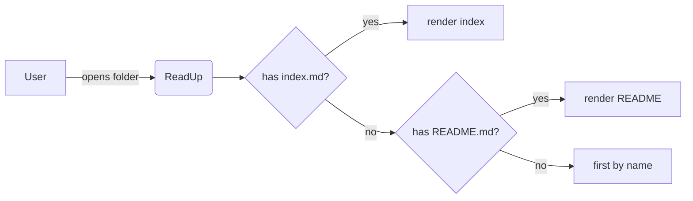

# ReadUp — Sample Document

This is the entry document for the sample folder. ReadUp picks it because it
is called `index.md`.

## Inline formatting

You can write **bold**, _italic_, ~~strikethrough~~, and `inline code`.
Bare links like https://example.com get auto-linked in GFM and Extended.

## Lists & task lists

- A list item
  - With nesting
- Another item

Task list:

- [x] Choose a stack (Tauri + Svelte)
- [x] Wire up Mermaid
- [ ] Ship a beta

## Code highlighting

```rust
fn main() {
    let xs: Vec<i32> = (0..5).collect();
    println!("{:?}", xs);
}
```

```typescript
const fib = (n: number): number => (n < 2 ? n : fib(n - 1) + fib(n - 2));
console.log(fib(10));
```

## Tables

| Feature      | CommonMark | GFM | Extended |
| ------------ | :--------: | :-: | :------: |
| Tables       |     ❌     | ✅  |    ✅    |
| Task lists   |     ❌     | ✅  |    ✅    |
| Footnotes    |     ❌     | ❌  |    ✅    |
| Definitions  |     ❌     | ❌  |    ✅    |

## Definition list (Extended only)

ReadUp
: A multiplatform markdown reader built with Tauri + Svelte.

Catppuccin
: A pastel theme used for the built-in light (Latte) and dark (Mocha) modes.

## Footnotes (Extended only)

ReadUp renders Mermaid diagrams natively[^mermaid].

[^mermaid]: Diagrams are rendered client-side from `mermaid` fenced blocks.

## Mermaid



## Image with remote fallback

This image lives locally next to the document:


A remote URL — if it fails it will fall back to a sibling file with the same
basename, then to a placeholder:


## Blockquote

> Read more. Edit less.
>
> — a useful aphorism
